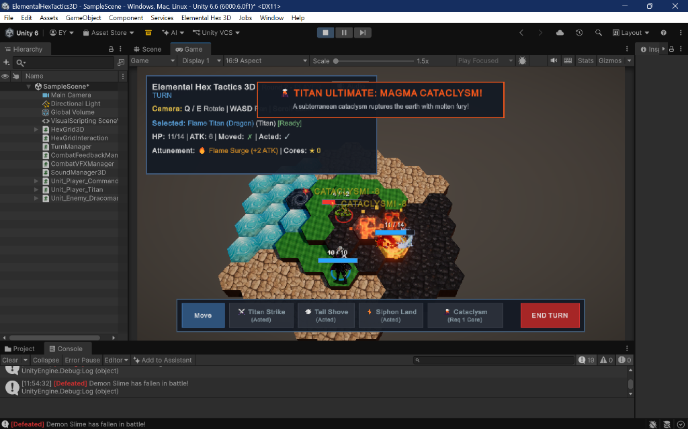

# ⚔️ Elemental Hex Tactics 3D

[-blue.svg?logo=unity)](https://unity3d.com)

> **A 2.5D HD-2D Tactical RPG combining dynamic elemental terrain reactions (*Divinity: Original Sin*) with kinetic hex grid push physics (*Into the Breach*) on elevated 3D hexagonal battlefields.**

---

## 📸 In-Game Screenshots

| 💥 Magma Cataclysm & Particle VFX | 🛡️ Tactical Action & Combat Grid |
| :---: | :---: |
|  |  |

---

## 🌟 Key Pillars

1. **Reactive Elemental Battlefield (*Divinity: Original Sin*):**
   - Fire, Water, and Earth interact dynamically on every hex tile.
   - Quench molten magma with water to trigger a **3-hex adjacent Steam Eruption** smokescreen.
   - Collapse earth into water to form a sticky **Mud Quagmire** that immobilizes advancing enemies.
   - Raise **Stone Pillars** from neutral earth to create physical obstacles and wall-slam collision surfaces.

2. **Kinetic Push & Wall-Slam Combos (*Into the Breach*):**
   - Every shove counts. Push enemies into cliffs, other units, or raised **Stone Pillars** to inflict **Wall Slam collision damage** (`💥 WALL SLAM! -2`).
   - Shove enemies off high ground or directly into hazard tiles (Molten Magma, Mud Traps, Deep Water).

3. **Status Denial Mobility Traps:**
   - Entering **Deep Water (Tier 2)** or **Mud** inflicts tactical mobility denial instead of flat tick damage:
     - **Turn 1 — `⛓️ Immobilized`:** Unit cannot move (Move range = 0).
     - **Turn 2 — `🦶 Crippled`:** Unit can only crawl 1 hex to escape (Move range capped at 1).
   - Water-attuned units and Colossal Titans possess natural immunities!

4. **FFT Geomancer-Style Attunement:**
   - Standing on elemental tiles dynamically grants units passive buffs:
     - **🔥 Flame Surge:** +2 Attack on Scorched/Magma tiles.
     - **💧 Aqua Surge:** +1 Move on Water tiles.
     - **💨 Vapor Shroud:** Mist cover on Steam tiles.
   - Siphon elemental energy from active tiles to harvest **Elemental Cores** that unleash devastating titan ultimates like **🌋 Magma Cataclysm**!

5. **HD-2D Diorama Aesthetic (*Triangle Strategy* / *Octopath Traveler*):**
   - 2.5D pixel-art billboard standees integrated into a full 3D polygonal hexagonal plateau.
   - Tilt-shift Bokeh Depth of Field, Radiant Bloom, ACES Tonemapping, and pure procedural particle VFX.
   - **Zero External Dependencies:** 100% procedural hex meshes, procedural particle textures (glow, spark, smoke), and in-memory shaders.

---

## 🎮 Quick Controls

| Control | Action |
| :--- | :--- |
| **Left Click** | Select unit / Target hex tile / Confirm action |
| **Right Click** | Deselect active action / Reset selection |
| **W / A / S / D** | Pan tactical camera smoothly across the plateau |
| **Q / E** | Orbit camera in cinematic 60° hexagonal increments |
| **Mouse Scroll** | Zoom camera in / out |
| **Action Bar (Bottom)** | Select actions: Move, Fireball, Water, Earth Spire, Push, Siphon, Ultimates |
| **End Turn (Far Right)** | Conclude player phase and pass turn to enemy AI |

---

## 📚 Comprehensive Documentation & Wiki

Explore the full game design and technical documentation in the [`wiki/`](./wiki/) directory:

- 📖 [**Wiki Home**](./wiki/Home.md) — Main documentation portal.
- 🎯 [**01. Overview & Tactical Controls**](./wiki/01-Overview-and-Controls.md) — Pitch, camera controls, turn economy.
- 🌋 [**02. Elemental Reaction Matrix**](./wiki/02-Elemental-Reaction-Matrix.md) — Complete Fire, Water, Earth reaction rules.
- 💥 [**03. Kinetic Combat & Hazards**](./wiki/03-Kinetic-Combat-and-Hazards.md) — Shoves, Wall-Slams, Deep Water, Mud traps.
- 🧙 [**04. Units & Attunement**](./wiki/04-Units-and-Attunement.md) — Commander, Magma Titan, Dracomancer, Attunement buffs.
- ⚙️ [**05. Technical Architecture**](./wiki/05-Technical-Architecture.md) — Unity 6 URP, procedural mesh & VFX systems.

---

## 🛠️ Quick Start in Unity 6

1. Open the project in **Unity 6 (6000.0.x)** with Universal Render Pipeline (URP).
2. Open scene `Assets/Scenes/SampleScene.unity`.
3. Press **Play (`Ctrl + P`)**.
4. To rebuild the battlefield from scratch at any time, click top menu:  
   **`Elemental Hex 3D` $\rightarrow$ `Setup 3D Hex Battlefield`**.

---

**Developed with ❤️ by Elang Esa Yudhistira (Neal Sage / NealversePrime)**  
*Solo Indie Game Designer & Programmer*
