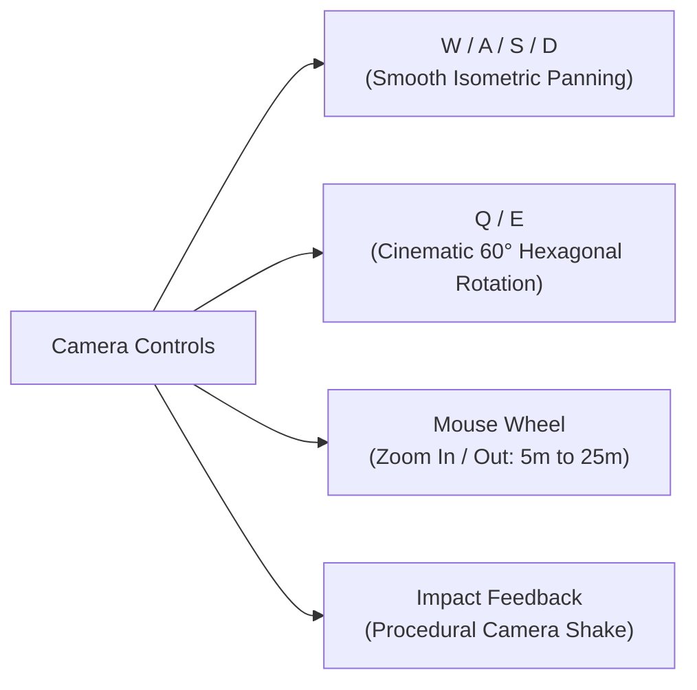

# 01. Overview, Camera & Tactical Controls

## 🎯 Game Concept & Vision

**Elemental Hex Tactics 3D** is a turn-based tactical RPG that merges the spatial combat mechanics of modern tactics games with the emergent systemic chemistry of immersive sims:

- **The Spatial Puzzle of *Into the Breach*:** Every turn is a puzzle of positioning, push angles, and environmental collision damage. Shoving an enemy is often more devastating than attacking them head-on.
- **The Systemic Chemistry of *Divinity: Original Sin*:** Elements do not simply deal elemental damage types; they fundamentally transform the 3D terrain beneath your units' feet into pools of magma, quenching vapor clouds, sticky quagmires, and raised stone bastions.
- **The Dynamic Attunement of *Final Fantasy Tactics*:** Geomancer-inspired environmental attunements reward players for reading the terrain and controlling key tactical ground.
- **The HD-2D Visual Aesthetic of *Triangle Strategy*:** 2.5D pixel-art standee billboarding across elevated 3D hexagonal pillars with tilt-shift depth-of-field and radiant bloom.

---

## 🕹️ Tactical Camera Controls

The camera system is managed by [`TacticalCameraController.cs`](../Assets/Scripts/Camera/TacticalCameraController.cs), designed to deliver smooth tactical agency:

### Key Bindings:
| Key / Input | Tactical Function | Notes |
| :--- | :--- | :--- |
| **`W` `A` `S` `D`** | **Pan Camera** | Moves the camera target smoothly relative to the current camera orientation. |
| **`Q`** | **Rotate Left 60°** | Snaps the camera perspective 60° counter-clockwise to align perfectly with the hex grid edges. |
| **`E`** | **Rotate Right 60°** | Snaps the camera perspective 60° clockwise to align with the hex grid edges. |
| **`Mouse Scroll`** | **Zoom In / Out** | Smoothly interpolates the camera distance between 5.0m (close inspection) and 25.0m (strategic battlefield overview). |
| **Middle Mouse Drag** | **Free Pan** | Optional alternative mouse drag for navigation. |

> [!TIP]
> Pressing **`Q`** or **`E`** uses smoothed spherical interpolation (`Mathf.SmoothDampAngle`). You never lose track of unit positions during rotations!

---

## ⏱️ Turn Structure & Action Economy

The turn loop is coordinated by [`TurnManager3D.cs`](../Assets/Scripts/Turn/TurnManager3D.cs). Combat proceeds in structured rounds consisting of alternating faction phases.

### Round Progression:
1. **Player Phase:**
   - All Player units (Commander and Magma Titan) refresh their action economy (`ResetTurnActions()`).
   - Environmental hazards on player tiles are resolved (Magma burns, Deep Water/Mud traps).
   - Player can select and command units in any order.
   - When all desired actions are executed, player clicks **`END TURN`**.
2. **Enemy Phase:**
   - Enemy squad (Dracomancer and Demon Slime) activates sequentially.
   - Intelligent AI evaluates closest targets, pathfinds around obstacles and cliffs, advances, and unleashes spells or kinetic shoves.
3. **Round Advance:**
   - Debuffs tick down on round completion (`OnTurnEnd()`).
   - Round counter increments and control returns to the Player.

### Unit Action Economy (Move + Act):
Each unit has two independent action flags per turn:
- **`HasMovedThisTurn`:** Unit can move up to its `EffectiveMoveRange` along valid hex paths.
- **`HasActedThisTurn`:** Unit can execute one combat ability (Spell, Melee Strike, Kinetic Push, or Siphon Land).
- **`IsExhausted`:** When a unit has both moved and acted, its base ring dims to gray (`ExhaustedColor`) to signal that its turn is complete.

---

## 🖥️ Tactical HUD & Interface

The user interface is drawn cleanly via [`HexGridInteraction3D.cs`](../Assets/Scripts/InputHandling/HexGridInteraction3D.cs) with 100% opaque slate backgrounds to ensure maximum readability:

1. **Top-Left Tactical HUD (`Rect(16, 16, 400, 185)`):**
   - Displays Round number, Active Turn Phase, Audio Mute toggle, and Camera Shortcuts.
   - Displays selected unit's Name, Faction, Archetype, HP, ATK, Moved/Acted status, Elemental Attunement, and stored **Elemental Cores**.
   - When hovering over hexes, displays coordinates, elevation, and terrain state.

2. **Top Turn Announcement Banner:**
   - Displays turn transitions (`⚔️ ENEMY PHASE`, `ROUND X - PLAYER TURN`, `ENEMY MOVEMENT`, etc.).
   - **Anti-Overlap System:** Automatically clamped to `minX = 430f` on compact resolutions so it **never** collides with or obscures the top-left HUD panel.

3. **Bottom Action Bar (`Width: 800px`):**
   - **Universal Move Button:** Toggles movement mode. Shows `[Moved]` when expended.
   - **Commander Abilities:** `🔥 Fireball (Dmg 3)`, `💧 Water (Dmg 2)`, `⛰️ Earth Spire (Wall/Mud)`, `💨 Push (Shove 1)`, `⚡ Siphon Land`.
   - **Titan Abilities:** `⚔️ Titan Strike (Heavy Melee)`, `💨 Tail Shove (Kinetic Push)`, `⚡ Siphon Land`, `🌋 Cataclysm (Ultimate)`.
   - **End Turn Button:** Concludes the player phase immediately.

4. **⚡ Predictive Ghost UI Preview:**
   - When aiming an elemental spell (`Fireball`, `Water`, or `Earth Spire`) at a hex tile, a predictive tactical card appears in the bottom-right viewport.
   - Clearly reveals the **predicted reaction name**, resulting tile state, resulting tier level, and tactical description **before** committing the action!

