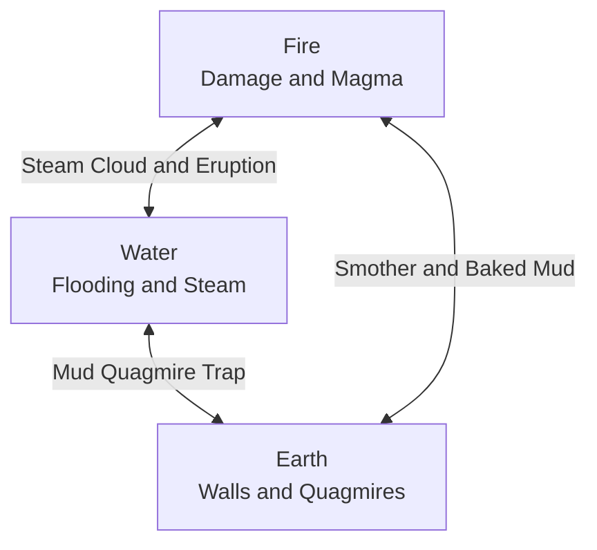

# 02. Elemental Reaction Matrix (Core Triad)

The battlefield in **Elemental Hex Tactics 3D** is living matter. Every hex tile possesses an **Elemental State** and a **Tier Level** governed by [`TerrainReactionSystem.cs`](https://github.com/NealversePrime/ElementalHexTactics3D/blob/main/Assets/Scripts/Combat/TerrainReactionSystem.cs).

---

## 🌋 The Core Triad: Fire, Water, Earth

---

---

## ⚡ Quick 2D Cross-Reference Matrix

The fastest way to look up any interaction: find the **Target Ground** row on the left, then look under the **Spell Cast** column.

| Target Ground State | 🔥 Fireball (Fire) | 💧 Water Surge (Water) | ⛰️ Earth Spire (Earth) |
| :--- | :--- | :--- | :--- |
| **Barren / Grass (T0)** | **Scorched Earth (T1)** | **Shallow Water (T1)** | **Stone Pillar (T2 Wall)** |
| **Scorched Earth (T1)** | **Molten Magma (T2)** *(3 Dmg Hazard)* | **Steam Cloud (T1)** *(Local Vapor)* | **Barren (T0)** *(Embers Smothered)* |
| **Molten Magma (T2)** | *(Refreshes Magma)* | **Scorched (T1) + 💥 3 Steam Eruptions!** | **Barren (T0)** *(Lava Smothered)* |
| **Shallow Water (T1)** | **Steam Cloud (T1)** *(Vapor Cover)* | **Deep Water (T2)** *(Mobility Trap)* | **Mud Quagmire (T1)** *(Immobilize Trap)* |
| **Deep Water (T2)** | **Steam Cloud (T1)** *(Vapor Cover)* | *(Refreshes Deep Water)* | **Mud Quagmire (T1)** *(Immobilize Trap)* |
| **Mud Quagmire (T1)** | **Baked Mud (Scorched T1)** | **Flooded Mud (Water T1)** | **Barren (T0)** *(Quagmire Compacted)* |
| **Steam Cloud (T1)** | **Scorched Earth (T1)** | **Shallow Water (T1)** | **Stone Pillar (T2 Wall)** |

---

## 🎯 Reactions Grouped by Spell Cast

Looking to see what a specific spell in your action bar can accomplish? Check your spell below:

### 💧 Water Surge (`💧 Water`)
| When Cast On... | Resulting State | Tier | Reaction Name | Tactical Effect |
| :--- | :--- | :---: | :--- | :--- |
| **Molten Magma (T2)** | **Scorched Earth** | 1 | **Steam Cataclysm** | Cools lava to Scorched Earth; **violently erupts Steam on 3 random adjacent hexes**! |
| **Scorched Earth (T1)** | **Steam Cloud** | 1 | **Steam Eruption** | Quenches burning embers into neutral ground and creates a local Steam Cloud. |
| **Shallow Water (T1)** | **Deep Water** | 2 | **Deep Water Surge** | Deepens water into treacherous **Deep Water (Immobilize & Cripple Trap)**. |
| **Mud Quagmire (T1)** | **Shallow Water** | 1 | **Flooded Mud** | Dilutes thick mud back into shallow surface water. |
| **Barren / Grass (T0)** | **Shallow Water** | 1 | **Water Inundation** | Floods dry soil with shallow water. |

### 🔥 Fireball (`🔥 Fire`)
| When Cast On... | Resulting State | Tier | Reaction Name | Tactical Effect |
| :--- | :--- | :---: | :--- | :--- |
| **Water (T1 or T2)** | **Steam Cloud** | 1 | **Steam Cloud** | Instantly boils water away into an obscuring **Steam Cloud (Vapor Cover)**. |
| **Scorched Earth (T1)** | **Molten Magma** | 2 | **Magma Surge** | Intensifies hot embers into molten **Magma (3 Burn Dmg Hazard)**. |
| **Mud Quagmire (T1)** | **Scorched Earth** | 1 | **Baked Mud** | Bakes wet mud with intense flame into dry, scorched ground. |
| **Barren / Grass (T0)** | **Scorched Earth** | 1 | **Scorched Earth** | Chars vegetation and dry soil into Scorched Earth. |

### ⛰️ Earth Spire (`⛰️ Earth`)
| When Cast On... | Resulting State | Tier | Reaction Name | Tactical Effect |
| :--- | :--- | :---: | :--- | :--- |
| **Water (T1 or T2)** | **Mud Quagmire** | 1 | **Quagmire Mud Trap** | Mixes earth into water to create sticky **Mud (Immobilize & Cripple Trap)**. |
| **Barren / Grass / Steam** | **Stone Pillar** | 2 | **Earth Spire** | Raises a solid **+1.0m Stone Pillar obstacle** for **Wall-Slam combos**! |
| **Magma / Scorched** | **Barren Earth** | 0 | **Earth Smother** | Smothers glowing embers or molten rock, resetting tile to neutral ground. |
| **Mud Quagmire (T1)** | **Barren Earth** | 0 | **Earth Fill** | Compacts extra soil into the quagmire to restore firm dry earth. |

---

## 🧪 Tactical Recipe Finder ("How Do I Create...?")

- **💨 Want a Smokescreen / Mist (Steam Cover)?**
  - *Best:* Cast `💧 Water` on `🌋 Magma` → Quenches lava + creates **3 adjacent random steam clouds**!
  - *Fast:* Cast `🔥 Fire` on `💧 Water` or `💧 Water` on `🔥 Scorched` → Creates 1 local steam cloud.
- **💩 Want an Immobility Trap (Mud Quagmire)?**
  - Cast `⛰️ Earth Spire` on any `💧 Water` tile → Instantly creates a sticky Mud Trap (Turn 1: Immobilized, Turn 2: Crippled).
- **⛰️ Want a Solid Wall / Cover (Stone Pillar)?**
  - Cast `⛰️ Earth Spire` on any `Barren`, `Grass`, or `Steam` tile → Raises a +1.0m obstacle for **`💥 WALL SLAM! -2`** combos.
- **🌋 Want a Molten Hazard (Magma)?**
  - Cast `🔥 Fire` on `🔥 Scorched Earth` → Upgrades to Molten Magma (3 Burn Dmg to non-titans).

---

## 🔍 In-Depth Breakdown of Key Reactions

### 1. Water on Magma: The 3-Hex Steam Eruption
When molten **Magma (Tier 2)** is hit by water:
1. The targeted magma hex cools to **Scorched Earth (Tier 1)**.
2. In the surrounding ring of 6 adjacent hexes, exactly **3 random tiles** (excluding existing magma or steam) erupt into **`TileState.Steam`**.
3. Procedural white billowing smoke particle clouds are triggered across all 3 hexes via `CombatVFXManager.Instance.PlaySteamCloud`.
4. **Tactical Value:** Creates an instant, unpredictable tactical fog bank that provides mist cover (*Vapor Shroud*) and obscures enemy sightlines without blanketing the entire map.

### 2. Earth on Water: The Quagmire Mud Trap
When `⛰️ Earth Spire` is cast onto a water tile:
1. The water mixes with dense earth to create **`TileState.Mud`**.
2. Mud is visibly rendered with a rich, dark clay-brown tint (`#6B4426`).
3. Stepping or being pushed into Mud denies movement: **Turn 1 = Immobilized (0 Move)**, **Turn 2 = Crippled (1 Move)**.
4. **Tactical Value:** Establish chokepoints in shallow waterways to halt enemy advances.

### 3. Earth Spire: The Movable Wall-Slam Buffer
When `⛰️ Earth Spire` is cast onto neutral ground (`Barren`, `Grass`, or `Steam`):
1. A solid **`TileState.StonePillar`** emerges from the ground.
2. The hex tile physically pops upward by **+1.0m** in world space.
3. Pathfinding registers the tile as completely impassable (`movementCost = -1`).
4. **Tactical Value:** Create your own cover anywhere on flat terrain! Shoving an enemy into this newly raised pillar immediately triggers a **`💥 WALL SLAM! -2`** collision combo.

---

## ⚡ Ghost UI Predictive System

Before committing any elemental spell, hovering over any hex tile renders the **Ghost UI** preview card in the bottom-right corner:
- **Header:** Reaction name (e.g., `⚡ GHOST UI: Steam Cataclysm & Magma Cool`).
- **Target:** Hex coordinates and current state/tier.
- **Output:** The resulting state and tier (highlighted in golden yellow if a reaction occurs).
- **Description:** A concise italic summary explaining what will happen.

