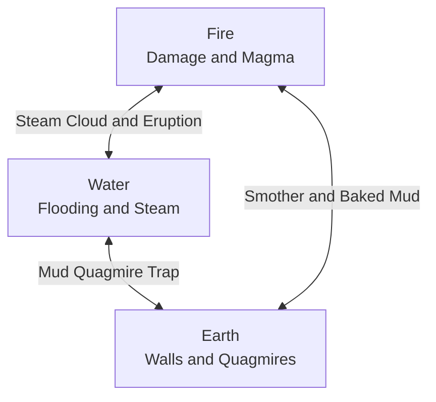

# 02. Elemental Reaction Matrix (Core Triad)

The battlefield in **Elemental Hex Tactics 3D** is living matter. Every hex tile possesses an **Elemental State** and a **Tier Level** governed by [`TerrainReactionSystem.cs`](../Assets/Scripts/Combat/TerrainReactionSystem.cs).

---

## 🌋 The Core Triad: Fire, Water, Earth

---

## 📋 Comprehensive Reaction Lookup Table

| Target Tile State | Spell Cast | Resulting State | Tier | Reaction Name | Tactical Effect |
| :--- | :--- | :--- | :---: | :--- | :--- |
| **Magma (T2 Fire)** | `💧 Water` | **Scorched** | 1 | **Steam Cataclysm** | Magma cools to Scorched Earth; **violently erupts Steam Cloud on exactly 3 random adjacent neighbor hexes**! |
| **Scorched (T1 Fire)** | `💧 Water` | **Steam** | 1 | **Steam Eruption** | Quenches burning embers into neutral dry earth and leaves a local **Steam Cloud**. |
| **Water (T1 Water)** | `🔥 Fire` | **Steam** | 1 | **Steam Cloud** | Water instantly boils away into a thick, obscuring **Steam Cloud**. |
| **Scorched (T1 Fire)** | `🔥 Fire` | **Magma** | 2 | **Magma Surge** | Intensifies burning embers into molten **Magma (Hazard: 3 Burn Dmg)**. |
| **Water (T1 Water)** | `💧 Water` | **Water** | 2 | **Deep Water Surge** | Deepens shallow water into treacherous **Deep Water (Mobility Trap)**. |
| **Water (T1/T2)** | `⛰️ Earth` | **Mud** | 1 | **Quagmire Mud Trap** | Collapses heavy earth into water, creating a sticky **Mud Trap (Immobilizes units)**. |
| **Mud (Quagmire)** | `💧 Water` | **Water** | 1 | **Flooded Mud** | Dilutes thick mud back into shallow surface water. |
| **Mud (Quagmire)** | `🔥 Fire` | **Scorched** | 1 | **Baked Mud** | Bakes wet mud with intense flame into dry, scorched ground. |
| **Mud (Quagmire)** | `⛰️ Earth` | **Barren** | 0 | **Earth Fill** | Compacts extra soil into the quagmire to restore firm dry earth. |
| **Magma / Scorched** | `⛰️ Earth` | **Barren** | 0 | **Earth Smother** | Smothers glowing embers with earth, cooling the tile to neutral ground. |
| **Barren / Grass / Steam** | `⛰️ Earth` | **Stone Pillar** | 2 | **Earth Spire** | Raises a solid **Stone Pillar obstacle** (+1.0m elevation) for **Wall-Slam setups**! |
| **Barren / Grass** | `🔥 Fire` | **Scorched** | 1 | **Scorched Earth** | Chars vegetation and soil into Scorched Earth. |
| **Barren / Grass** | `💧 Water` | **Water** | 1 | **Water Inundation** | Floods dry soil with Shallow Water. |

---

## 🔍 In-Depth Breakdown of Key Reactions

### 1. Water on Magma: The 3-Hex Steam Eruption
When molten **Magma (Tier 2)** is hit by water:
1. The targeted magma hex cools to **Scorched Earth (Tier 1)**.
2. In the surrounding ring of 6 adjacent hexes, exactly **3 random tiles** (excluding existing magma or steam) erupt into **`TileState.Steam`**.
3. Procedural white billowing smoke particle clouds are triggered across all 3 hexes via `CombatVFXManager.Instance.PlaySteamCloud`.
4. **Tactical Value:** Creates an instant, unpredictable tactical fog bank that provides mist cover (*Vapor Shroud*) and obscures enemy sightlines without blanketing the entire map.

### 2. Earth on Water: The Quagmire Mud Trap
When `⛰️ Earth Spire` is cast onto a water tile:
1. The water mixes with dense earth to create **`TileState.Mud`**.
2. Mud is visibly rendered with a rich, dark clay-brown tint (`#6B4426`).
3. Stepping or being pushed into Mud denies movement: **Turn 1 = Immobilized (0 Move)**, **Turn 2 = Crippled (1 Move)**.
4. **Tactical Value:** Establish chokepoints in shallow waterways to halt enemy advances.

### 3. Earth Spire: The Movable Wall-Slam Buffer
When `⛰️ Earth Spire` is cast onto neutral ground (`Barren`, `Grass`, or `Steam`):
1. A solid **`TileState.StonePillar`** emerges from the ground.
2. The hex tile physically pops upward by **+1.0m** in world space.
3. Pathfinding registers the tile as completely impassable (`movementCost = -1`).
4. **Tactical Value:** Create your own cover anywhere on flat terrain! Shoving an enemy into this newly raised pillar immediately triggers a **`💥 WALL SLAM! -2`** collision combo.

---

## ⚡ Ghost UI Predictive System

Before committing any elemental spell, hovering over any hex tile renders the **Ghost UI** preview card in the bottom-right corner:
- **Header:** Reaction name (e.g., `⚡ GHOST UI: Steam Cataclysm & Magma Cool`).
- **Target:** Hex coordinates and current state/tier.
- **Output:** The resulting state and tier (highlighted in golden yellow if a reaction occurs).
- **Description:** A concise italic summary explaining what will happen.

