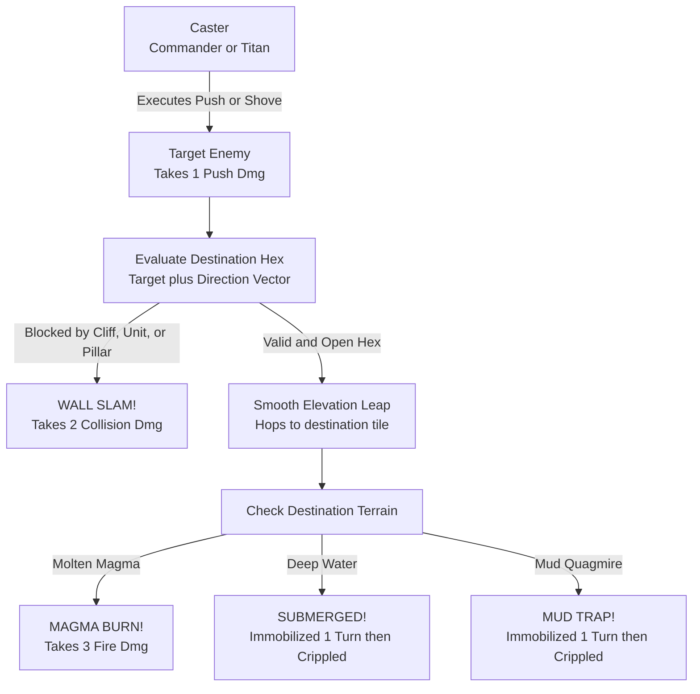

# 03. Kinetic Combat, Wall Slams & Hazards

In **Elemental Hex Tactics 3D**, combat is heavily physical. Inspired by *Into the Breach*, manipulating unit positions and forcing collisions is one of the most effective ways to win battles.

---

## 💨 The Kinetic Push Mechanic

Kinetic push attacks are executed via [`PushMechanic3D.cs`](https://github.com/NealversePrime/ElementalHexTactics3D/blob/main/Assets/Scripts/Combat/PushMechanic3D.cs):



### Directional Calculation:
When a push action is triggered, `PushMechanic3D.GetPushDirection()` calculates the exact hex vector from the caster's coordinates to the target's coordinates:

```text
PushDirection = TargetCoordinates - CasterCoordinates
```

If the caster is adjacent to the target, the push direction aligns with one of the 6 hexagonal axes. The target is shoved exactly 1 hex along this trajectory.

---

## 💥 Wall Slam Collision Physics

A push displacement is considered **Blocked** if any of the following conditions are met:
1. **Off-Grid Edge:** The destination coordinates are beyond the boundary of the battlefield.
2. **Occupied Tile:** Another unit is already standing on the destination hex.
3. **Steep Cliff:** The destination tile has an elevation difference greater than 1 level (elevation difference > 1).
4. **Solid Stone Pillar:** The destination tile has a raised `TileState.StonePillar`.

### Collision Consequences:
When a push is blocked:
- The target unit **does not move** into the blocked space.
- The target immediately suffers **`💥 WALL SLAM! -2`** bonus collision damage.
- The camera triggers a seismic jolt (`TacticalCameraController.Shake(0.32f, 0.35f)`).
- An explosive cone of procedural rock debris and sparks erupts from the impact point (`CombatVFXManager.PlayWallSlam`).
- A heavy impact sound plays (`SoundManager3D.PlaySlam(1.3f)`).

> [!TIP]
> **Deliberate Wall-Slam Combo:** Use the Commander's `⛰️ Earth Spire` to erect a `StonePillar` behind an enemy, then use the Titan's `💨 Tail Shove` or Commander's `💨 Push` to slam them into it for guaranteed burst damage!

---

## 🌊 Mobility Status Denial Traps

Instead of dealing passive damage, deep fluids and quagmires deny enemy agency through **turn denial**:

### 1. `⛓️ Immobilized` (Turn 1):
- **Effect:** The unit's `EffectiveMoveRange` is reduced to **0**.
- The unit cannot walk or jump to any tile during its movement phase.
- Overhead floating combat text announces: `🌊 SUBMERGED! (Immobilized)` or `💩 MUD TRAP! (Immobilized)`.
- Base ring indicator glows with a dark amber/brown trap indicator (`#BF7333`).

### 2. `🦶 Crippled` (Turn 2):
- **Effect:** The unit's `EffectiveMoveRange` is capped at **1** hex (maximum 1 tile).
- The unit can only crawl 1 hex to escape the hazard.
- Overhead text announces: `CRIPPLED (Move: 1)`.

### 3. Hazard Resolution Rules:
- **Stepping In:** If a unit moves into Deep Water or Mud during their normal move, their mobility is locked on landing.
- **Being Pushed In:** If a unit is shoved into Deep Water or Mud, the mobility debuff triggers immediately upon arrival.
- **Turn Start in Hazard:** If a unit begins its round standing in Deep Water or Mud, the debuffs refresh automatically.

---

## 🛡️ Elemental & Archetype Immunities

| Hazard / Trap | Effect on Mortals | Water-Attuned Units | Colossal Titans |
| :--- | :--- | :---: | :---: |
| **Molten Magma** | 3 Burn Damage | ❌ Suffers Damage | ✅ **Immune** (Molten scales) |
| **Deep Water (Tier 2)** | Submersion (Immobilize + Cripple) | ✅ **Immune** (Aquatic mobility) | ✅ **Immune** (Colossal stature) |
| **Mud Quagmire** | Mud Trap (Immobilize + Cripple) | ❌ Trapped | ✅ **Immune** (Tramples through) |

