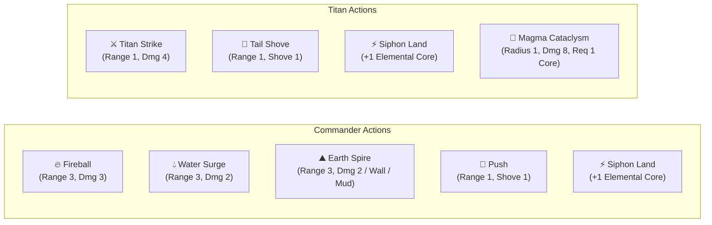

# 04. Units, Archetypes & FFT Attunement

In **Elemental Hex Tactics 3D**, battles feature a focused **2v2 skirmish** designed to showcase deep interplay between humanoid commanders, colossal summoned titans, and responsive terrain.

---

## 👥 The 2v2 Skirmish Roster

| Unit | Faction | Archetype | Affinity | HP | ATK | Move | Role & Capabilities |
| :--- | :--- | :--- | :--- | :---: | :---: | :---: | :--- |
| **Commander** | Player | **Commander** | None | 10 | 3 | 3 | Tactical caster. Master of elemental spells (`Fireball`, `Water`, `Earth Spire`), kinetic pushes, and land siphoning. |
| **Magma Titan** | Player | **Titan** | Fire | 18 | 4 | 2 | Colossal behemoth. Immune to Magma, Deep Water, and Mud. Boasts devastating melee attacks (`Titan Strike`), long `Tail Shove`, and the game-ending `Magma Cataclysm`. |
| **Dracomancer** | Enemy | **Commander** | Fire | 10 | 3 | 3 | Enemy pyromancer boss. Casts ranged Fireballs and advances aggressively toward player units. |
| **Demon Slime** | Enemy | **Minion** | None | 8 | 2 | 3 | Mobile frontliner. Uses melee strikes and kinetic shoves to knock player units off elevated ground. |

---

## ⚔️ Unit Abilities & Commands

### Detailed Ability Breakdown:

#### 1. `🔥 Fireball` (Commander)
- **Range:** 3 Hexes | **Damage:** 3 HP
- **Effect:** Launches a fiery projectile. Deals direct damage and transforms terrain (Water $\rightarrow$ Steam, Scorched $\rightarrow$ Magma).

#### 2. `💧 Water Surge` (Commander)
- **Range:** 3 Hexes | **Damage:** 2 HP
- **Effect:** Hurls an arc of pressurized water. Quenches Magma (spawning 3 steam clouds) and Scorched Earth.

#### 3. `⛰️ Earth Spire` (Commander)
- **Range:** 3 Hexes | **Damage:** 2 HP
- **Effect:** Erupts sharp rock spires. Erects a solid **`StonePillar`** on neutral earth, or creates a **`Mud`** quagmire on water.

#### 4. `💨 Kinetic Push` / `💨 Tail Shove` (Universal)
- **Range:** 1 Hex (Melee) | **Damage:** 1 HP
- **Effect:** Deals 1 damage and physically shoves the target 1 hex backward. Triggers **Wall-Slam collisions** if blocked.

#### 5. `⚡ Siphon Land` (Commander / Titan)
- **Range:** Current tile or 6 adjacent neighbors.
- **Requirement:** Target hex must be active elemental ground (`Magma`, `Scorched`, or `Water`).
- **Effect:** Consumes the elemental energy from the tile, resetting it to neutral `Barren` ground and granting the unit **+1 Elemental Core** (`★`).

#### 6. `🌋 Magma Cataclysm` (Titan Ultimate)
- **Cost:** 1 Elemental Core (`★`) | **Range:** 2 Hexes (Target Epicenter)
- **Area of Effect:** Epicenter + all 6 surrounding neighbor hexes (7 hexes total).
- **Damage:** **8 Massive Damage** to all enemies caught in the blast radius!
- **Terrain Eruption:** Upgrades all Scorched tiles to molten Magma, and chars neutral tiles to Scorched.
- **Sensory Feedback:** Violent camera screen shake (`0.65f`), seismic booming audio, procedural shockwave rings, and soaring fiery embers.

---

## 🧙 FFT Geomancer-Style Attunement

Standing on active environmental tiles passively infuses units with FFT-inspired dynamic buffs evaluated continuously by [`TacticalUnit3D.UpdateAttunement()`](../Assets/Scripts/Units/TacticalUnit3D.cs):

### 1. `🔥 Flame Surge`
- **Trigger:** Unit stands on `Scorched Earth` or `Magma` with Fire Affinity or Titan archetype.
- **Buff:** **+2 Bonus Attack Damage** on all physical strikes!
- **Visuals:** Base ring glows radiant fiery orange-gold (`#FF841A`, scale $1.15\times$).
- **Immunity:** Titans gain full immunity to Magma burn damage. (Humanoid casters still take damage if immersed in molten lava).

### 2. `💧 Aqua Surge`
- **Trigger:** Unit stands on `Water` with Water Affinity or Titan archetype.
- **Buff:** **+1 Bonus Move Range**!
- **Visuals:** Base ring glows brilliant electric cyan (`#33D9FF`, scale $1.15\times$).

### 3. `💨 Vapor Shroud`
- **Trigger:** Unit stands inside a `TileState.Steam` vapor cloud.
- **Buff:** Conceals the unit inside billowing mist, granting damage mitigation and obscuring sightlines.
