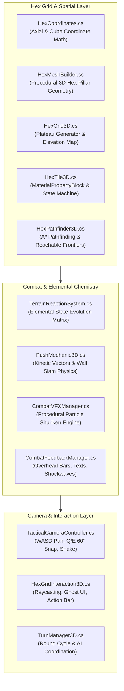

# 05. Technical Architecture & Systems Design

**Elemental Hex Tactics 3D** is engineered for maximum performance, maintainability, and zero external dependency friction in **Unity 6 (6000.0 URP)**.

---

## 🏛️ System Architecture Overview



---

## 💎 The Zero-External-Asset Architecture

A foundational technical goal of this codebase is **100% self-reliance**. The project runs straight out of a clean git clone without requiring any paid Asset Store packages, external plugins, or third-party DLLs.

### How It Works:
1. **Procedural 3D Hex Mesh Generation (`HexMeshBuilder.cs`):**
   - Pointy-topped hexagonal 3D pillars are procedurally calculated and built at runtime.
   - Generates two submeshes per tile:
     - **Submesh 0 (Top Surface):** Mapped with edge-to-edge normalized square UVs ($[0, 1] \times [0, 1]$) so any square terrain texture fits seamlessly without seam artifacts.
     - **Submesh 1 (Pillar Walls):** 6 vertical side quads mapped with seamless vertical cliff UV coordinates.
2. **Procedural Particle Textures (`CombatVFXManager.cs`):**
   - Textures for particle systems are baked into memory as C# `Texture2D` instances:
     - **Soft Glow (`CreateSoftGlowTexture`):** $64 \times 64$ smooth radial gradient.
     - **Star Spark (`CreateCrossSparkTexture`):** $64 \times 64$ four-point optical cross spark for sharp impact flashes.
     - **Cloud Puff (`CreateCloudTexture`):** $64 \times 64$ multi-frequency soft billow for smoke and steam clouds.
   - Mapped to native `Universal Render Pipeline/Particles/Unlit` materials using Additive and Alpha-Blended transparency.
3. **Unity 6 ParticleSystem Safety Protocol:**
   - In Unity 6, modifying ParticleSystem duration or looping properties while the system is alive throws editor warnings.
   - Solved with an atomic helper:
     ```csharp
     ParticleSystem ps = obj.AddComponent<ParticleSystem>();
     ps.Stop(true, ParticleSystemStopBehavior.StopEmittingAndClear);
     // ...configure main, emission, shape, velocity modules...
     ```

---

## 🎨 HD-2D Visual Stack (*Triangle Strategy* Style)

The diorama aesthetic is powered by the URP Volume Profile ([`SampleSceneProfile.asset`](../Assets/Settings/HD2D_TacticsProfile.asset)):

### 1. Tilt-Shift Bokeh Depth of Field
- **Mode:** `Bokeh`
- **Focus Distance:** `12.0f` (aligned with the main battlefield plateau).
- **Focal Length:** `65mm`
- **Aperture:** `f/3.2`
- **Visual Impact:** Creates a creamy, miniature tabletop diorama effect where units and tiles in the center are crystal sharp, while the far edges and deep abyss blur softly.

### 2. Radiant Bloom
- **Threshold:** `0.85` | **Intensity:** `1.15` | **Scatter:** `0.65`
- **Visual Impact:** Molten magma tiles, fiery embers, and spell projectiles radiate vibrant light that spills over neighboring terrain edges.

### 3. ACES Tonemapping & Color Adjustments
- **Tonemapping Mode:** `ACES`
- **Post Exposure:** `+0.25` | **Contrast:** `18` | **Saturation:** `15`
- **Visual Impact:** Deep, rich shadows with saturated elemental hues reminiscent of high-end Japanese tactical RPGs.

---

## ⚡ Performance & Zero-GC Memory Management

To maintain a rock-solid 60+ FPS on all platforms:

1. **`MaterialPropertyBlock` Everywhere:**
   - [`HexTile3D.cs`](../Assets/Scripts/Grid/HexTile3D.cs) uses `MaterialPropertyBlock` for all tile hover, selection, and mud/granite tinting.
   - **Zero Material Cloning:** No calls to `renderer.material` (which instantiates duplicate material copies and causes GC spikes). All tiles share common material instances while retaining independent per-hex tints.
2. **UI Click-Through Prevention:**
   - In [`HexGridInteraction3D.cs`](../Assets/Scripts/InputHandling/HexGridInteraction3D.cs), custom GUI buttons consume the click event via `Event.current.Use()`.
   - The 3D raycasting system checks `IsPointerOverUI()` before firing, completely preventing clicks on HUD or Action Bar buttons from erroneously clicking 3D hex tiles in the background.
3. **Axial & Cube Coordinate Mathematics:**
   - [`HexCoordinates.cs`](../Assets/Scripts/Grid/HexCoordinates.cs) implements cube coordinates $(q, r, s)$ where $q + r + s = 0$.
   - Manhattan distance between any two hexes is calculated in $\mathcal{O}(1)$ time:
     $$\text{dist}(A, B) = \frac{|q_A - q_B| + |r_A - r_B| + |s_A - s_B|}{2}$$
   - Fast $k$-ring radius generation without redundant loops.
